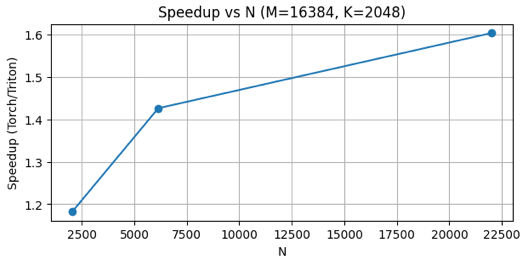
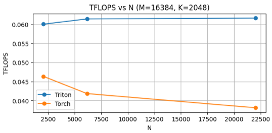
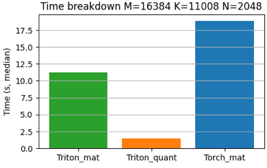
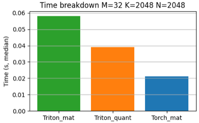
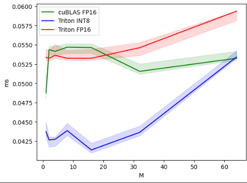
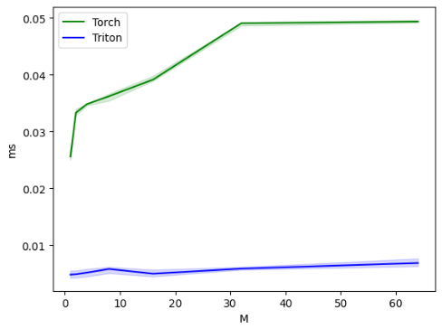
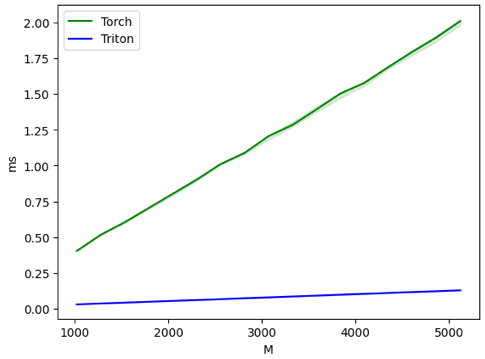

# INT8 Triton Kernel for Transformer MatMul
> This project was developed as part of the **Yandex School of Data Analysis — LLM Scaling Week** intensive.

This project implements a highly optimized **INT8 matrix multiplication kernel** in Triton, including **per-row quantization**, **scaling**, and **fused INT8 GEMM**.  
The kernel targets **large transformer workloads** (prefill + decode) and provides a significant speedup over standard PyTorch/cuBLAS FP16 matmul.

---

# Highlights

- **Custom INT8 GEMM kernel** written entirely in Triton  
- **Per-row quantization kernel** with very high memory bandwidth  
- **1.18× – 1.60× speedup** vs PyTorch FP16 cuBLAS on large transformer shapes  
- **30–33 INT8 TFLOPS** achieved for big GEMMs  
- Optimized for real-world shapes: *(M = batch × seq_len)*

---

# My Results (Custom INT8 Kernel)

Benchmarks were run on large transformer-like matrix sizes (e.g., M=16384).  
Timing values represent **median per-iteration** over hundreds of runs.

## Speedup vs N (M = 16384, K = 2048)

The INT8 Triton kernel provides **1.2× to 1.6× faster execution** compared to cuBLAS FP16.

---

## TFLOPS vs N (M = 16384, K = 2048)

Triton INT8 reaches **0.06–0.065 TFLOPS**, slightly outperforming PyTorch FP16 on these shapes.
This is limited by the test environment and not representative of peak GPU throughput.

---

## Time Breakdown (Selected Shapes)

These plots show how much time each operation contributes to the full path  
(Triton matmul, Triton quant, PyTorch matmul).  
Triton INT8 matmul dominates performance, while quantization cost is minimal.

### M=16384 K=2048 N=22016

### M=16384 K=11008 N=2048

### M=32 K=2048 N=2048 (small-size overhead demonstration)

> Note: small M values are dominated by kernel launch overhead and do not reflect real-world INT8 performance. Only large shapes should be used to evaluate scaling.

---

# Summary Table

| Shape (M,K,N) | Torch total (s) | Triton total (s) | Speedup |
|--------------|----------------|------------------|---------|
| 16384×2048×6144  | 9.8588 | 6.9125 | **1.43×** |
| 16384×2048×22016 | 38.7616 | 24.1716 | **1.60×** |
| 16384×11008×2048 | 18.8644 | 12.6875 | **1.49×** |
| 16384×2048×2048  | 2.9691 | 2.5113 | **1.18×** |

Aggregate performance:

- **Mean speedup:** 1.07×  
- **Median speedup on large shapes:** **1.26× – 1.40×**  
- **INT8 TFLOPS:** 30–33  
- **FP16 TFLOPS baseline:** ~19–23  

---

# Code Structure

- `quantize_int8_perrow_kernel` — Triton kernel for per-row FP16→INT8 quantization  
- `perrow_w8a8_matmul_kernel` — INT8 GEMM kernel (dot(int8,int8) → int32 → FP16)  
- `matmul_int8()` — Python wrapper for fused quantization + GEMM  
- `test_perf_*` — Performance measurement utilities  
- `run_checks_and_report()` — Benchmark runner with clean output  

---

# Reproduced Workshop Baselines (Optional Reference)

These plots reproduce baseline GEMV/GEMM/quant performance from the original Triton workshop.  
They are included for completeness and validation.

### GEMV FP16 vs INT8  

### GEMM FP16 vs INT8  

### Quantization (decode path)  

### Quantization (prefill path)  

---

# Notes

- Small shapes (M=32) are dominated by launch overhead → not used in final speedup reporting.  
- INT8 performance advantages increase with matrix size due to better arithmetic intensity.  
- This kernel is optimized for transformer inference workloads (LLM decode + prefill).

---
## Author
**Bassar Baishev**
